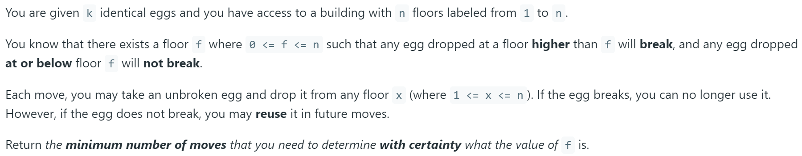
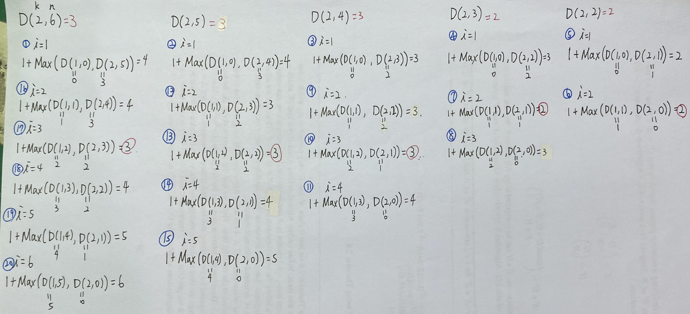
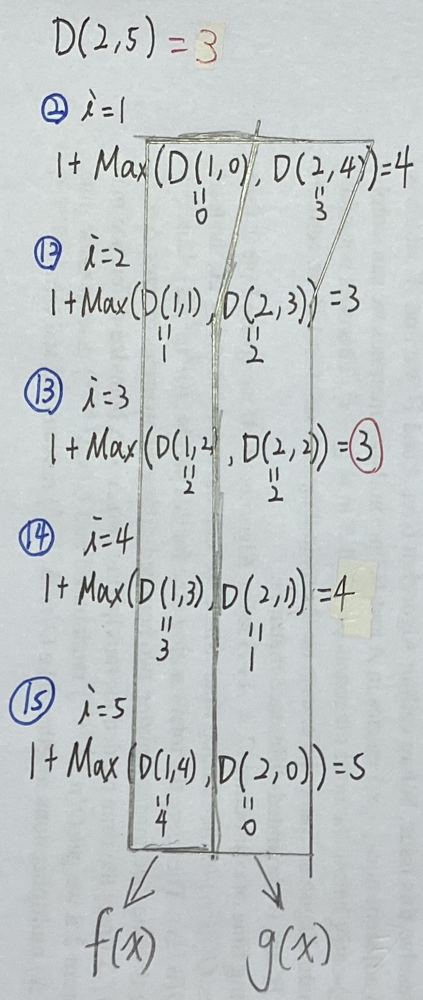

<!--
_class: lead
_paginate: false
-->

# Leetcode 887: Super Egg Drop
## 107703006 資科四 楊永靖

---

# Problem
<!--  -->
- You are given k identical eggs and you have access to a building with n floors labeled from 1 to n.
- You know that there exists a floor f where 0 <= f <= n such that any egg dropped at a floor higher than f will break, and any egg dropped at or below floor f will not break.
- Each move, you may take an unbroken egg and drop it from any floor x (where 1 <= x <= n). If the egg breaks, you can no longer use it. However, if the egg does not break, you may reuse it in future moves.
- Return the minimum number of moves that you need to determine with certainty what the value of f is.

---

# Solution 1 (DP)
- k eggs, n floor
- Drop egg from i floor.
  - Broken => test floors under i (k-1 eggs remain)
  - Unbroken => test floors above i (n-i floors in total, k eggs remain)

---

# Recurrence Relation
$$\begin{gather*}
    k\ \text{eggs}, \quad n\ \text{floors} \\
    \begin{aligned}
        \text{Base case} \quad
        \left\{
            \begin{matrix}
                k &=& 0 \quad \text{return 0}\\
                k &=& 1 \quad \text{return n}\\
                n &<=& 1 \quad \text{return n}
            \end{matrix}
        \right.
    \end{aligned}\\
    ans = min(ans, 1 + max(dp(k-1, i-1), dp(k, n-i)))\\
    \\
    \begin{aligned}
        \text{Broken} => &dp(k-1, i-1)& =>& (k-1) &\text{eggs and} \quad (i-1) \quad \text{floors to check.}\\
        \text{Unbroken} => &dp(k, n-i)& =>& (k) &\text{eggs and} \quad (n-i) \quad \text{floors to check.}
    \end{aligned}
\end{gather*}$$

---



---

# Code
```c++
int superEggDrop(int K, int N) {
    // Init table for record
    vector<vector<int>> table(K+1, vector<int>(N+1, INT_MAX));
    // Recursion (lambda expression)
    function<int(int, int)> dp = [&](int k, int n) {
        // Base case
        if(k == 0) return 0;
        else if(k == 1) return n;
        else if(n <= 1) return n;
        int& ans = table[k][n];
        if(ans != INT_MAX) return ans;  // dp(k, n) has done
        for(int i=1; i<=n; i++) {   // Drop from i floor
            ans = min(ans, 1 + max(dp(k-1, i-1), dp(k, n-i)));
        }
        return ans;
    };
    return dp(K, N);
}
```

---

# Complexity (TLE)
$$\begin{gather*}
  \begin{aligned}
    &\text{\# of subproblems}\ O(KN)\text{, complexity of each take}\ O(N)\\
    &\begin{aligned}
      &\text{Time complexity} &\quad& O(KN^2)\\
      &\text{Space complexity} &\quad& O(KN)
    \end{aligned}
  \end{aligned}
\end{gather*}$$

---

# Solution 2 (DP)
- f(x) is monotonic increase.
- g(x) is monotonic decrease.
- Binary search.



---

# Recurrence Relation
$$\begin{gather*}
    k\ \text{eggs}, \quad n\ \text{floors} \\
    \begin{aligned}
        \text{Base case} \quad
        \left\{
            \begin{matrix}
                k &=& 0 \quad \text{return 0}\\
                k &=& 1 \quad \text{return n}\\
                n &<=& 1 \quad \text{return n}
            \end{matrix}
        \right.
    \end{aligned}\\
    \text{Search i with binary search.}\\
    ans = min(ans, 1 + max(dp(k-1, i-1), dp(k, n-i)))\\

\end{gather*}$$

---    

# Code
```c++
int superEggDrop(int K, int N) {
    vector<vector<int>> table(K+1, vector<int>(N+1, INT_MAX));
    function<int(int, int)> dp = [&](int k, int n) {
        if(k == 0) return 0;
        else if(k == 1) return n;
        else if(n <= 1) return n;
        int& ans = table[k][n];
        if(ans != INT_MAX) return ans;  // dp(k, n) has done
        int left = 1, right = n + 1;
        while(left < right) {   // Binary search
            int i = left + (right - left) / 2;    // Drop from i floor
            if(dp(k-1, i-1) >= dp(k, n-i))  right = i;
            else                            left = i + 1;
        }
        ans = 1 + max(dp(k-1, left-1), dp(k, n-left));
        return ans;
    };
    return dp(K, N);
}
```

---

# Complexity
$$\begin{gather*}
  \begin{aligned}
    &\text{\# of subproblems}\ O(KN)\text{, complexity of each take}\ O(\log N)\\
    &\begin{aligned}
      &\text{Time complexity} &\quad& O(KN \log N)\\
      &\text{Space complexity} &\quad& O(KN)
    \end{aligned}
  \end{aligned}
\end{gather*}$$

---

# More on binary search ...


---

# Solution 3 (DP)
- Inverted problem.
- dp(i) is the number of floors that can be measured with i eggs.
- Maintain a counter to count the number of moves.
- Test i from k to 1.

---

# Recurrence Relation
$$\begin{gather*}
    \begin{aligned}
        &res = \text{number of all moves now}\\
        &for(i = k\ to\ 1):\\
        &\quad dp[i] = dp[i - 1] + dp[i] + 1\\
    \end{aligned}
    \\
    \begin{aligned}
        \text{Broken} => &dp(i-1)& =>& \text{Use}\quad (i-1) &\text{eggs and check floor in} \quad (res-1) \quad \text{moves.}\\
        \text{Unbroken} => &dp(i)& =>& \text{Use}\quad (i) &\text{eggs and check floor in} \quad (res-1) \quad \text{moves.}\\

        \text{Current floor} => &\text{+1}
    \end{aligned}
    \\
    \\
    \text{Using '+' instead of 'max' is because dp() stands for "moves" not "floors".}
\end{gather*}$$

---

# Code
```c++
int superEggDrop(int K, int N) {
    // Init table for record
    vector<int> dp(K + 1);

    int res = 0;
    for (; dp[K] < N; ++res) {  // Max floor smaller than given => drop
        for (int i = K; i > 0; --i) {   // Use 
            dp[i] = dp[i] + dp[i - 1] + 1;
        }  
    }

    return res;
}
```

---

# Complexity
$$\begin{gather*}
  \begin{aligned}
    &\text{\# of subproblems}\ O(logN)\text{, complexity of each take}\ O(K)\\
    &\begin{aligned}
      &\text{Time complexity} &\quad& O(K \log N)\\
      &\text{Space complexity} &\quad& O(K)
    \end{aligned}
  \end{aligned}
\end{gather*}$$

---

# Solution 4 (Mathematical Thought)
- If we have K eggs on hand, and we can move n times. 
- Then set the maximum number of floors we can test to fun(k,n), and we can calculate the fun(k,n) from the following formula:

$fun(k,n)=n + n(n-1)/2! + n(n-1)(n-2)/3! + …… + n(n-1)(n-2)……（n-k)/k!$

We can slowly increase n, or we can do a binary search between n and N to find The smallest n, so that fun(k,n) is greater than or equal to N.

[reference](https://leetcode.com/problems/super-egg-drop/discuss/181702/Clear-C%2B%2B-codeRuntime-0-msO(1)-spacewith-explation.No-DPWhat-we-need-is-mathematical-thought)

---

# Code
```c++
class Solution {
public:
    int superEggDrop(int k, int N) {
        if (k == 1 || N<3) return N;
        //n is the number of eggs we need when we do binary search
        double n = log(N) / log(2);
        // If the number of eggs is not enough to support our binary search, 
        // slowly increase the number of moves n until the return value of the fun function is 
        // greater than or equal to the target floor N
        if (k < n++) 
            while (fun(k, n) < N) ++n;
        return n;
    }
private: 
    //In the worst case,
    // the maximum number of floors that can be tested if 
    // the number of moves is n and the number of eggs is k
    int fun(int k, int n) {
        int i=1,temp = 1, maxNumOfF = 0;
        while (i <= k) {
            temp = temp*(n--) / (i++);
            maxNumOfF += temp;
        }
        return maxNumOfF;
    }
};
```